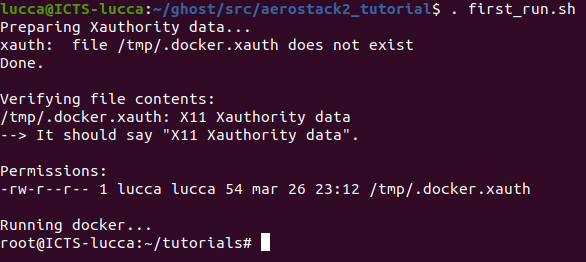
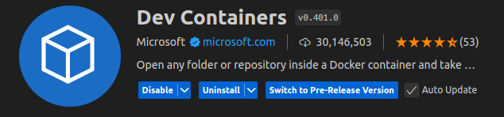
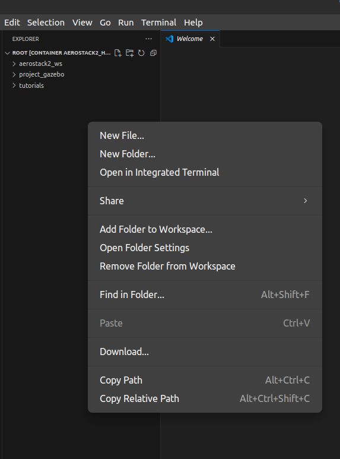
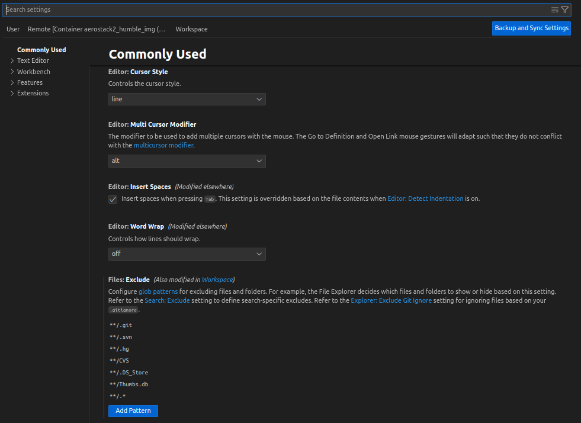

Build com Docker
================

Esta página faz parte do tópico "Build com Docker para visualizar o drone voando em simulação".

**Conteúdo básico:** Aqui você aprenderá como configurar e realizar o build do ambiente Docker.

**Tempo médio para o setup:** 45 min. 

Instalação do Docker Engine
---------------------------

Siga os passos abaixo para instalar o Docker Engine no Ubuntu. 

Fonte: `Docker Engine Installation <https://docs.docker.com/engine/install/ubuntu/>`_

1. Adicione a chave GPG oficial do Docker:

   .. code-block:: bash

      sudo apt-get update
      sudo apt-get install ca-certificates curl
      sudo install -m 0755 -d /etc/apt/keyrings
      sudo curl -fsSL https://download.docker.com/linux/ubuntu/gpg -o /etc/apt/keyrings/docker.asc
      sudo chmod a+r /etc/apt/keyrings/docker.asc

2. Configure o repositório oficial do Docker:

   .. code-block:: bash

      echo "deb [arch=$(dpkg --print-architecture) signed-by=/etc/apt/keyrings/docker.asc] \
      https://download.docker.com/linux/ubuntu $(. /etc/os-release && echo "${UBUNTU_CODENAME:-$VERSION_CODENAME}") stable" | \
      sudo tee /etc/apt/sources.list.d/docker.list > /dev/null
      sudo apt-get update

3. Instale os pacotes do Docker:

   .. code-block:: bash

      sudo apt-get install docker-ce docker-ce-cli containerd.io docker-buildx-plugin docker-compose-plugin

Executando Docker sem sudo
--------------------------

Após a instalação, configure o Docker para ser executado sem `sudo`.

1. Crie o grupo `docker` e adicione seu usuário:

   .. code-block:: bash

      sudo groupadd docker
      sudo usermod -aG docker $USER
      sudo reboot

2. Após reiniciar, execute:

   .. code-block:: bash

      newgrp docker

Instalação do NVIDIA Container Toolkit (Opcional)
-------------------------------------------------

Se você possui uma GPU da NVIDIA, siga esses passos para configurar o suporte ao Docker. 

Fonte: `NVIDIA Container Toolkit <https://docs.nvidia.com/datacenter/cloud-native/container-toolkit/latest/install-guide.html>`_

1. Configure o repositório de produção:

   .. code-block:: bash

      curl -fsSL https://nvidia.github.io/libnvidia-container/gpgkey | sudo gpg --dearmor -o /usr/share/keyrings/nvidia-container-toolkit-keyring.gpg && \
      curl -s -L https://nvidia.github.io/libnvidia-container/stable/deb/nvidia-container-toolkit.list | \
      sed 's#deb https://#deb [signed-by=/usr/share/keyrings/nvidia-container-toolkit-keyring.gpg] https://#g' | \
      sudo tee /etc/apt/sources.list.d/nvidia-container-toolkit.list

2. Opcionalmente, ative pacotes experimentais:

   .. code-block:: bash

      sed -i -e '/experimental/ s/^#//g' /etc/apt/sources.list.d/nvidia-container-toolkit.list

3. Atualize os pacotes e instale o NVIDIA Container Toolkit:

   .. code-block:: bash

      sudo apt-get update
      sudo apt-get install -y nvidia-container-toolkit

4. Configure o Docker para utilizar a NVIDIA Container Runtime:

   .. code-block:: bash

      sudo nvidia-ctk runtime configure --runtime=docker

5. Reinicie o daemon do Docker:

   .. code-block:: bash

      sudo systemctl restart docker

Habilitando Aplicações Gráficas no Container
--------------------------------------------

Para permitir a execução de aplicações gráficas dentro do container, execute:

.. code-block:: bash

   xhost +local:docker

Para evitar a necessidade de rodar esse comando sempre, adicione-o ao seu `.profile` ou `.bashrc`:

.. code-block:: bash

   echo "xhost +local:docker > /dev/null" >> ~/.profile

.. code-block:: bash

   echo "xhost +local:docker" >> ~/.bashrc

Build e Execução do Container Docker
-------------------------------------

Siga os passos abaixo para criar e executar um container Docker com o aerostack2_tutorial.

1. Clone o repositório do projeto:

   .. code-block:: bash

      git clone git@github.com:ghost-drones/aerostack2_tutorial.git

2. Configure a variável de ambiente para ativar o BuildKit:

   .. code-block:: bash

      export DOCKER_BUILDKIT=1

3. Compile a imagem do Docker a partir do diretório raiz do projeto:

   .. code-block:: bash

      docker build --ssh default -t aerostack2_humble_img .

4. Execute o container pela primeira vez:

   .. code-block:: bash

      ./first_run.sh

   Esse script criará um container chamado `aerostack2_humble_cont` e abrirá um terminal dentro dele. Algo assim:

5. Para reutilizar o container em sessões futuras, utilize:

   .. code-block:: bash

      docker start -i aerostack2_humble_cont && docker exec -it aerostack2_humble_cont /bin/bash

6. Pode ser interessante adicionar um alias no seu .bashrc para facilitar esse acesso.

   .. code-block:: bash

      echo "alias aerostack2_tutorial='docker start -i aerostack2_humble_cont && docker exec -it aerostack2_humble_cont /bin/bash'" >> ~/.bashrc

Outros Comandos Úteis
---------------------

- Sair do container: (Dentro do container)

  .. code-block:: bash

     exit

- Para abrir outro shell dentro do container em execução:

  .. code-block:: bash

     docker exec -it aerostack2_humble_cont bash

- Para parar o container:

  .. code-block:: bash

     docker stop aerostack2_humble_cont

- Para remover o container:

  .. code-block:: bash

     docker rm aerostack2_humble_cont

Se o container for removido, você sempre pode recriá-lo do zero executando o script `first_run.sh` novamente.

Com essa configuração, seu ambiente estará pronto para rodar simulações do Aerostack2 utilizando Docker.

VS Code - Utils
---------------------

Instale a extensão `Dev Containers <https://code.visualstudio.com/docs/devcontainers/containers>`_ no VS Code para
que a experiência de desenvolvimento dentro do Docker seja melhor.

Além disso, você pode filtrar tipos de arquivos para "limpar" seu VS Code. Recomendo
fortemente retirar os dotfiles. Para fazer isso, siga os passos abaixo:

1 - Aperte com o botão direito do mouse na aba que ficam seus arquivos e selecione "Open Folder Settings".

2 - Procure por "Files: Exclude" e adicione qualquer padrão de arquivos que quiser. Para remover os dotfiles, coloque `**/.*`

