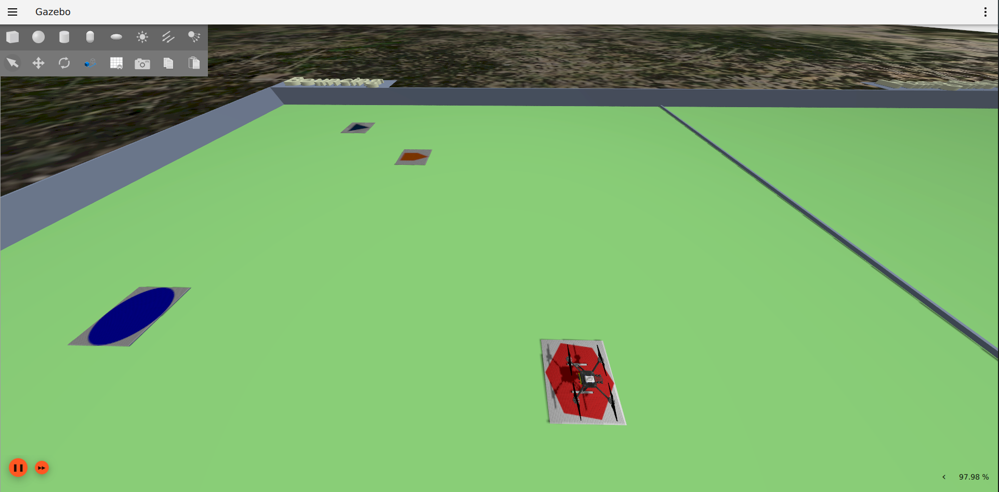

Competição 3 - Bouncing
=======================

Objetivo:

Use a configuração 3 de mundo eletroquad:

.. code-block:: bash

   . launch_eletroquad_as2.bash -3

Neste desafio, você deve pousar em todas as bases de marcadores, sem repetição. Não tem erro,
ache as bases com a Yolo e crie um controle para pousar autonomamente em cada uma.

