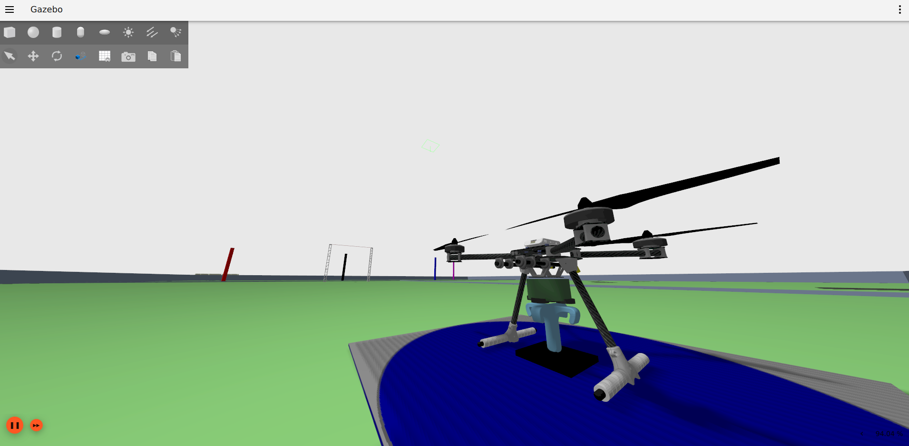

Competição 2 - Hang The Hook
=============================

Objetivo:

.. image:: images/hangthehook.png
   :align: center

Use a configuração 2 de mundo eletroquad:

.. code-block:: bash

   . launch_eletroquad_as2.bash -2

Neste desafio, você deve inserir um gancho customizado na mangueira vermelha. 
Como o mecanismo que a segura pode estar em qualquer ponto do mapa, será necessário 
localizá-lo. (Infelizmente, ainda não há linha azul no simulador.) Recomendo utilizar 
YOLO para identificar o mecanismo, focando na área de encaixe do gancho. Existem 
várias abordagens possíveis, então seja criativo(a).

Para acionar o mecanismo de sucção e encaixar o gancho do drone, publique um Booleano True no tópico:

.. code-block:: bash

   /drone0/sensor_measurements/gripper/suction_on

Para soltar, publique um False.

