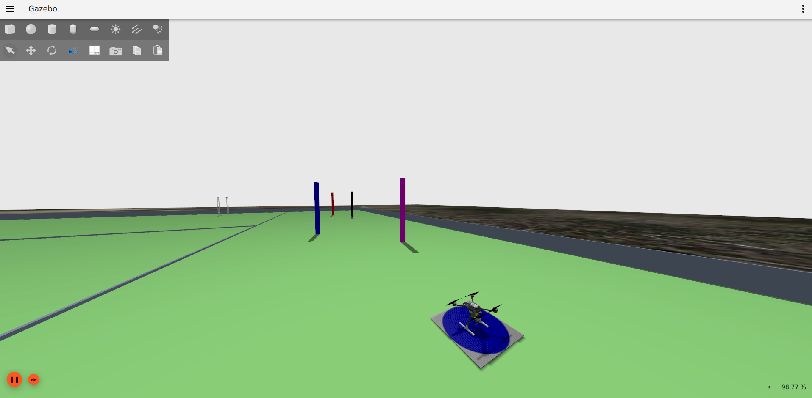

Competição 1 - Slalom
===========================

Objetivo:

.. image:: images/slalom.png
   :align: center

Use a configuração 1 de mundo eletroquad:

.. code-block:: bash

   . launch_eletroquad_as2.bash -1

Neste desafio, você deverá identificar as traves — sugiro 
utilizar técnicas como YOLO ou segmentação de cores — e 
navegar de forma semelhante à tarefa 4. Em outras palavras, 
use ferramentas de percepção para estimar a posição das traves 
e, a partir dessas informações, gerar sua trajetória.

