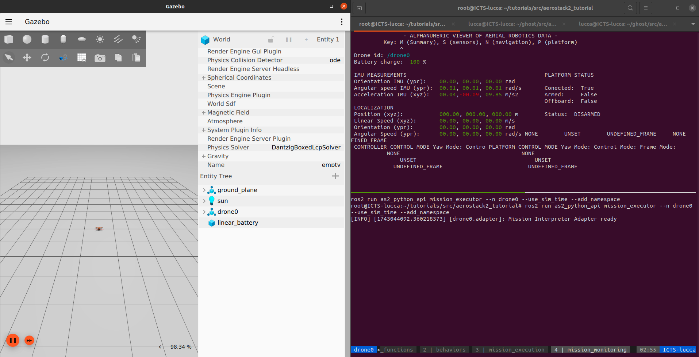
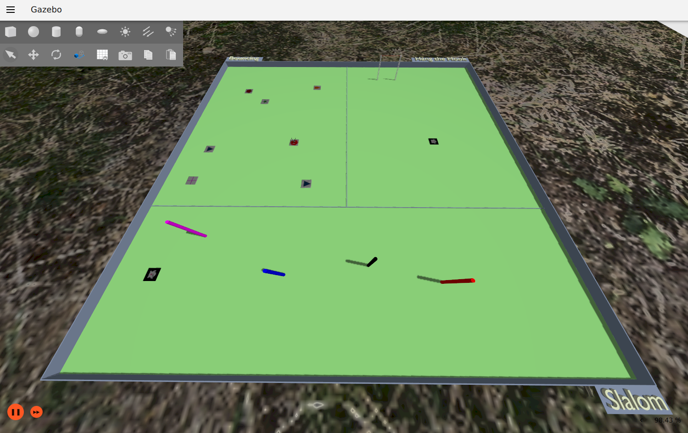
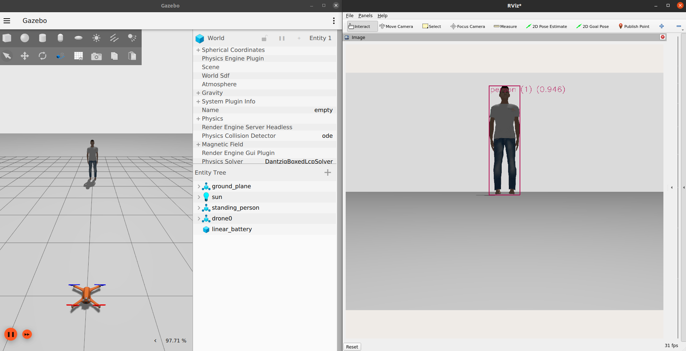

Execução Inicial
=================

Conteúdo básico: Aqui você aprenderá como executar a simulação completa e customizá-la.

---

Execução da Simulação
---------------------------

Assim que estiver dentro do Docker, vá até a pasta do `aerostack2_tutorial`:

.. code-block:: bash

   cd_tutorials # (cd /root/tutorials/src/aerostack2_tutorial)

Para executar a simulação, utilize um dos seguintes comandos:

.. code-block:: bash

   . launch_as2.bash  # Simulação padrão
   . launch_eletroquad_as2.bash  # Simulação mundo customizado Eletroquad
   . launch_eletroquad_as2.bash  -y # Simulação mundo customizado Eletroquad e Yolo

Existem vários parâmetros para executar a simulação, você pode ver todos eles em `Aerostack2-Docs <https://aerostack2.github.io/_02_examples/gazebo/project_gazebo/index.html>`_.

.. note:: 

    A única diferença entre os arquivos de lançamento está no .yaml, que define as configurações da simulação.
    Para ajustar qualquer parâmetro da sua simulação, edite o arquivo .yaml correspondente, que estará localizado no diretório: 
    `/root/tutorials/src/aerostack2_tutorial/tmuxinator`.
    
    Neste arquivo, você pode:

    - Adicionar ou remover abas no TMUX.
    - Modificar condições de execução.
    - Ajustar parâmetros da simulação.

Execução Padrão
---------------------------

Vamos começar com a simulação padrão, em um mundo vazio

.. code-block:: bash

   . launch_as2.bash

Deverá aparecer a simulação Gazebo com um drone e o terminal personalizado pelo `Tmuxinator <https://kuka-isir-vision-docs.readthedocs.io/en/latest/tips/tmux.html>`_.

.. note:: 

   O Tmuxinator é uma ferramenta que facilita a gestão de sessões do terminal tmux, permitindo a criação e o gerenciamento de configurações de sessões, 
   janelas e painéis de forma simples e automatizada. Com ele, é possível definir o layout de trabalho e os comandos a serem executados em cada janela 
   e painel, oferecendo uma maneira prática de configurar ambientes de desenvolvimento ou tarefas repetitivas no terminal. O Tmuxinator usa arquivos de 
   configuração no formato YAML, que permitem personalizar e replicar ambientes de maneira eficiente, tornando-o uma excelente escolha para quem trabalha 
   com múltiplas janelas ou processos no terminal.

Com o Tmuxinator também é possível criar atalhos para navegação entre os terminais e abas do Tmux. 
As configurações utilizadas no `aerostack2_tutorial` estão localizadas em `/root/tutorials/src/aerostack2_tutorial/to_copy/tmux` e foram copiadas para
`$HOME/.tmux.conf` no momento do build do container para que as alterações surtissem efeito. Se quiser, altere esse arquivo para customizar seu terminal e atalhos.

**Atalhos criados**:

Você deve soltar o (Ctrl + b) antes de apertar qualquer outra tecla para o comando funcionar

- (Ctrl + b) + k : Fecha todos os programas no TMUX

- (Ctrl + b) + [ : Sobe ou desce as linhas em alguma janela

- (Ctrl + b) + ↑ ↓ → ← : Muda as janelas

- (Ctrl + b) + 1 2 3 4 : Muda as abas

- (Ctrl + b) + k : Fechar todas as abas do TMUX

Vá então para a aba `user` e na janela superior execute uma missão demo:

.. code-block:: bash

   cd examples && python3 mission.py

Se tudo der certo você terá feito o primeiro voo simulado com o framework Aerostack2 :)

Execução Eletroquad
---------------------------

No mundo do Eletroquad, todos os modelos presentes são réplicas exatas dos itens que serão utilizados na competição presencial, com dimensões e cores compatíveis.

Ao iniciar a simulação, é necessário passar um parâmetro para escolher a tarefa que deseja resolver (Bouncing, HangTheHook ou Slalom). Durante a execução, os 
itens serão posicionados aleatoriamente em suas regiões válidas no mapa, e o seu drone (modelo X500) será colocado no ponto de partida da tarefa escolhida.

.. code-block:: bash

   . launch_eletroquad_as2.bash -1 # 1 = Slalom, 2 = HangTheHook, 3 = Bouncing

Execução Yolo
---------------------------

Para executar a YOLO na simulação, primeiro altere os parâmetros no arquivo de configuração específico do seu tmuxinator. Por exemplo, se estiver utilizando o 
launch_as2.bash, modifique o arquivo aerostack2.yaml, que é o arquivo que o tmux lerá para configurar a simulação.

Aqui está um exemplo de comando para iniciar a YOLO em uma máquina com GPU Nvidia, com a arquitetura v8 e utilizando as imagens da câmera do Gazebo no tópico indicado abaixo:

.. code-block:: bash

   ros2 launch yolo_bringup yolov8.launch.py use_3d:=False input_image_topic:=/drone0/sensor_measurements/gimbal/camera/image_raw device:=cuda:0

Caso você **não tenha uma GPU Nvidia** ou **não tenha configurado o container com o NVIDIA Container Toolkit**, use a CPU:

.. code-block:: bash

   device:=cpu

Além disso, para visualizar o resultado da detecção de um objeto, adicione-o ao mundo "empty". Para isso, insira o modelo standing_person em 
/root/tutorials/src/aerostack2_tutorial/config/world.yaml. Consulte o exemplo insert_model_example.yaml para entender como realizar essa configuração.

Agora você já pode executar sua simulação:

.. code-block:: bash

   . launch_as2.bash -y

Para visualizar a imagem gerada pela rede neural, abra o `rviz2` no terminal:

.. code-block:: bash

   rviz2

Em seguida, selecione o tópico de imagem gerado pelo wrapper da YOLO.

Você verá, então, algo parecido com isto:

