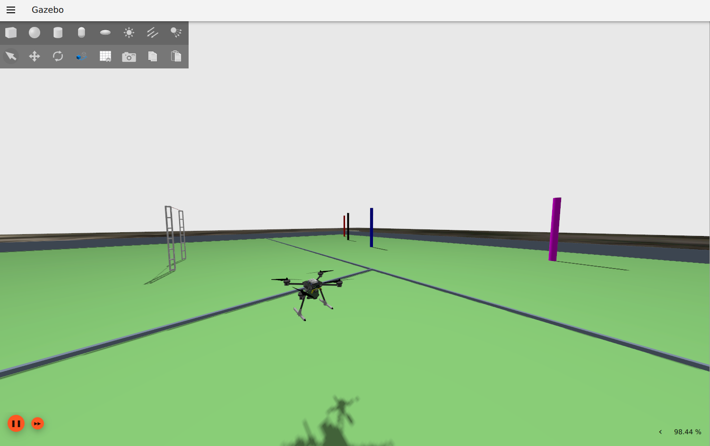

Bem-vindo à documentação do aerostack2_tutorial!
================================================

O **aerostack2_tutorial** é um projeto criado para os membros da equipe Ghost Drones, com o objetivo de ensinar e demonstrar o uso do Aerostack2 em aplicações com drones. O tutorial abrange desde a configuração e compilação com Docker até desafios avançados, como execução de tarefas com drones, treinamento de redes neurais e competições de navegação.

Desenvolvido por Lucca Gandra em mar/2025. Qualquer dúvida não hesite em me contatar em luccagandra@poli.ufrj.br.

Tópicos Abordados
-----------------

1. **Build e Execução**
   - Build com Docker.
   - Execução.

2. **Desafios Práticos**

   - **Tarefa 1 - Voo e Pouso (Navegação)**:  
     Voar, deslocar-se 2 metros para frente e pousar.   

   - **Tarefa 2 - Waypoint Simples (Navegação)**:  
     Voar, deslocar-se 2 metros com *facing goal*, deslocar-se 2 metros *not facing goal* e pousar.   

   - **Tarefa 3 - Trajetória Curva (Navegação)**:  
     Voar, realizar um círculo (curva) e pousar.   

   - **Tarefa 4 - Slalom (Navegação)**:  
     Dado um mundo com 3 cones, encontrar uma curva que passe por todos os pontos e pouse no landing pad final (não é necessário localizar o landing pad).    

   - **Tarefa 5 - Aruco Pose usando TF (Percepção)**:  
     Encontrar a posição de um aruco via *tf* e visualizar com RVIZ2.   

   - **Tarefa 6 - Bouncing Easy (Navegação, Percepção)**:  
     Dado um mundo com vários landing pads, executar trajetórias que permitam pousar e decolar em cada landing pad (as poses dos marcadores serão fornecidas).  

   - **Tarefa 7 - Treinamento com apenas um objeto (IA)**:  
     Treinar uma rede neural convolucional para reconhecer um marcador.  

   - **Tarefa 8 - Treinamento com vários objetos (IA)**:  
     Treinar uma rede neural convolucional para reconhecer vários marcadores.  

4. **Competições**

   - **Competição 1 - Drone Racing**:  
     Em um ambiente com múltiplas pistas de corrida, o drone deve planejar e executar uma trajetória que passe pelo centro de cada pista na ordem correta.  

   - **Competição 2 - Bouncing**:  
     Em um cenário com diversos pontos de pouso (*landing pads*), o drone deve identificar a quantidade de marcadores presentes, determinar o número de *landing pads* usando uma rede neural treinada e pousar em cada um no menor tempo possível.  

   - **Competição 3 - Tiro ao Alvo**:  
     Em um ambiente com vários *landing pads*, cada um contendo *arucos* e marcadores, o drone deve calcular uma trajetória que permita lançar uma bolinha em cada alvo, respeitando uma restrição dinâmica de distância.  

Instalação e Uso
----------------

Confira a seção de :doc:`usage <instalacao_e_uso>` para obter mais informações sobre a instalação e a execução do aerostack2_tutorial.

.. note::

   Este projeto está em desenvolvimento ativo e novas funcionalidades e desafios poderão ser adicionados.

.. toctree::
   :maxdepth: 2
   :caption: Conteúdo:

   build_e_execucao
   desafios_praticos
   competicoes