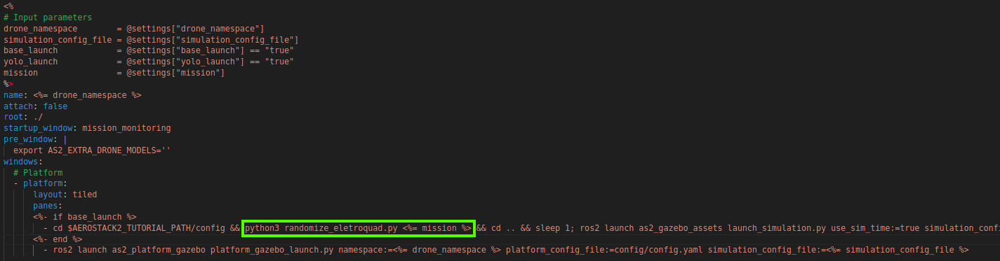

Tarefa 6 - Bouncing Easy (Navegação)
===============================================

Objetivo: Takeoff,
pousar e decolar de todas as bases,
não visitar a mesma base 2 vezes,
pousar na base inicial.

Como o foco desta tarefa é a navegação, e não a percepção, você não precisará identificar os marcadores por visão computacional. 
No entanto, deve considerar suas posições como fixas e definir o comportamento ideal a partir dessas informações.

Use o mundo 3 do launch eletroquad:

.. code-block:: bash

   . launch_eletroquad_as2.bash -3

Além disso, delete momentaneamente a linha que randomiza as posições dos objetos no mundo em /tmuxinator/aerostack2_eletroquad.yaml:

.. note::

  Utilize os exemplos presentes em `/examples` como inspiração para seu trabalho. Nomeie o arquivo como `mission_bouncing_easy.py`

Mundo: "grass" com as adições de modelos gerados por randomize_eletroquad.py.

Comportamento esperado: