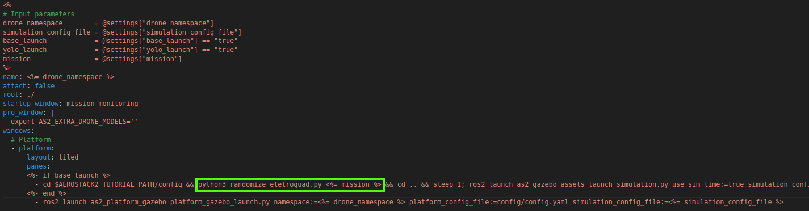

Tarefa 4 - Slalom (Navegação)
=============================

Objetivo: Takeoff 2 metros,
transitar alternadamente entre uma sequência de 4 traves,
pousar após passar por todas as traves.

Considere que você deverá passar pelas traves seguindo esses lados:
- Esquerda
- Direita
- Esquerda
- Esquerda

Como o foco desta tarefa é a navegação, e não a percepção, você não precisará identificar as traves por visão computacional. 
No entanto, deve considerar suas posições como fixas e calcular a trajetória ideal com base nisso.

Use a configuração 1 de mundo eletroquad:

.. code-block:: bash

   . launch_eletroquad_as2.bash -1

Além disso, delete momentaneamente a linha que randomiza as posições dos objetos no mundo em /tmuxinator/aerostack2_eletroquad.yaml:

.. note::

  Utilize os exemplos presentes em `/examples` como inspiração para seu trabalho. 
  Nomeie o arquivo como `mission_slalom.py`.

  NÃO use waypoints comuns para a trajetória. Gere uma curva ideal e transite por ela.

  Você deve usar o `Generate Polynomial Trajectory Behaviour <https://aerostack2.github.io/_04_robot_behaviors/index.html>`_ para resolver essa tarefa.

Mundo: "grass" com as adições de modelos gerados por randomize_eletroquad.py.

Comportamento esperado: